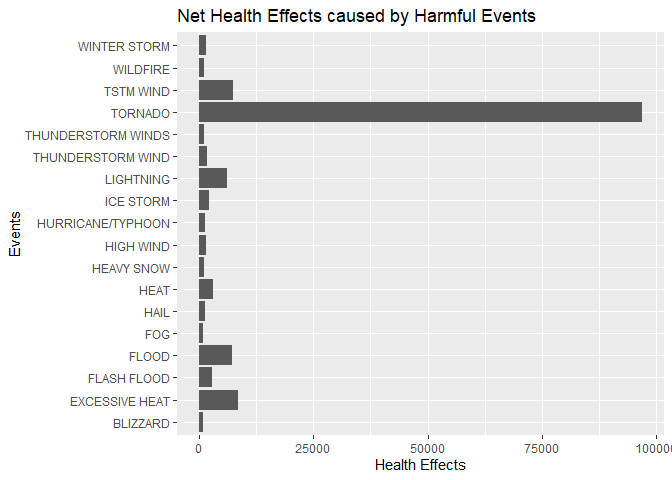
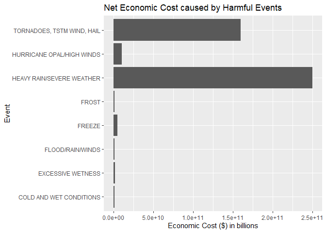

# NOAA Storm Database Analysis

This project involves the exploratory Data Analysis of the the U.S. National Oceanic and Atmospheric Administration's (NOAA) storm database in R.
This database consists of major storms and other environment related events in the United States. It includes information about time and place where the events occurred 
as well as estimates of havoc caused. 

Data used for this analysis can be downloaded from [here](https://d396qusza40orc.cloudfront.net/repdata%2Fdata%2FStormData.csv.bz2).

Resulting documents in pdf and html format can be found in the soruce files and this analysis can be found in the [RPubs](https://rpubs.com/muneeb706/655853). 
Following are the contents in the resulting documents:

Synopsis
--------

This document contains exploratory data analysis of NOAA Storm
Database.In this analysis I have tried to find most destructive events
in terms of population health and economic consequences. For population
health effects, I took number of fatalaties and injuries caused by each
event into account. For economic consequences, I took property damage
and crop damage expenses into account.To compare destruction caused by
harmful events, a bar plot was created for all of such events.

Data Processing
---------------

Loading the Storm Data from compressed comma separated file compressed
in bz2 format.

``` r
storm_data <- read.csv("./repdata_data_StormData.csv.bz2", header=T, sep=",")
head(storm_data)
```

    ##   STATE__           BGN_DATE BGN_TIME TIME_ZONE COUNTY COUNTYNAME STATE  EVTYPE
    ## 1       1  4/18/1950 0:00:00     0130       CST     97     MOBILE    AL TORNADO
    ## 2       1  4/18/1950 0:00:00     0145       CST      3    BALDWIN    AL TORNADO
    ## 3       1  2/20/1951 0:00:00     1600       CST     57    FAYETTE    AL TORNADO
    ## 4       1   6/8/1951 0:00:00     0900       CST     89    MADISON    AL TORNADO
    ## 5       1 11/15/1951 0:00:00     1500       CST     43    CULLMAN    AL TORNADO
    ## 6       1 11/15/1951 0:00:00     2000       CST     77 LAUDERDALE    AL TORNADO
    ##   BGN_RANGE BGN_AZI BGN_LOCATI END_DATE END_TIME COUNTY_END COUNTYENDN
    ## 1         0                                               0         NA
    ## 2         0                                               0         NA
    ## 3         0                                               0         NA
    ## 4         0                                               0         NA
    ## 5         0                                               0         NA
    ## 6         0                                               0         NA
    ##   END_RANGE END_AZI END_LOCATI LENGTH WIDTH F MAG FATALITIES INJURIES PROPDMG
    ## 1         0                      14.0   100 3   0          0       15    25.0
    ## 2         0                       2.0   150 2   0          0        0     2.5
    ## 3         0                       0.1   123 2   0          0        2    25.0
    ## 4         0                       0.0   100 2   0          0        2     2.5
    ## 5         0                       0.0   150 2   0          0        2     2.5
    ## 6         0                       1.5   177 2   0          0        6     2.5
    ##   PROPDMGEXP CROPDMG CROPDMGEXP WFO STATEOFFIC ZONENAMES LATITUDE LONGITUDE
    ## 1          K       0                                         3040      8812
    ## 2          K       0                                         3042      8755
    ## 3          K       0                                         3340      8742
    ## 4          K       0                                         3458      8626
    ## 5          K       0                                         3412      8642
    ## 6          K       0                                         3450      8748
    ##   LATITUDE_E LONGITUDE_ REMARKS REFNUM
    ## 1       3051       8806              1
    ## 2          0          0              2
    ## 3          0          0              3
    ## 4          0          0              4
    ## 5          0          0              5
    ## 6          0          0              6

Finding Most Harmful Events with respect to Population Health
-------------------------------------------------------------

Aggregating (sum) fatalities values w.r.t Event Type.

``` r
fatalities_per_event <- tapply(storm_data$FATALITIES, storm_data$EVTYPE, sum)
```

Aggregating (sum) injuries values w.r.t Event Type.

``` r
injuries_per_event <- tapply(storm_data$INJURIES, storm_data$EVTYPE, sum)
```

Taking sum of fatalities and injuries caused by each event. From now on
this sum will be referred by health effects.

``` r
health_effects_per_event <- fatalities_per_event + injuries_per_event
```

Excluding events with no health effects to find harmful events.

``` r
health_effects_per_harmful_event <- health_effects_per_event[health_effects_per_event > 0]
```

Converting health effects per harmful event object to DataFrame type.

``` r
health_effects_per_harmful_event_df <- data.frame(Event=names(health_effects_per_harmful_event), Health_Effects=health_effects_per_harmful_event,     row.names=NULL, stringsAsFactors=FALSE)

head(health_effects_per_harmful_event_df)
```

    ##          Event Health_Effects
    ## 1     AVALANCE              1
    ## 2    AVALANCHE            394
    ## 3    BLACK ICE             25
    ## 4     BLIZZARD            906
    ## 5 blowing snow              2
    ## 6 BLOWING SNOW             14

Caclulating average number of health effects caused by harmful events.

``` r
harmful_events_avg_effects <- mean(health_effects_per_harmful_event_df$Health_Effects)
harmful_events_avg_effects
```

    ## [1] 707.6045

### Results

Finding most harmful events by extracting events from the dataframe
having number of effects greater than average.

``` r
hlth_efcts_per_most_hrmfl_event_df <- health_effects_per_harmful_event_df[health_effects_per_harmful_event_df$Health_Effects > harmful_events_avg_effects, ]
hlth_efcts_per_most_hrmfl_event_df
```

    ##                  Event Health_Effects
    ## 4             BLIZZARD            906
    ## 32      EXCESSIVE HEAT           8428
    ## 42         FLASH FLOOD           2755
    ## 47               FLOOD           7259
    ## 52                 FOG            796
    ## 67                HAIL           1376
    ## 69                HEAT           3037
    ## 77          HEAVY SNOW           1148
    ## 93           HIGH WIND           1385
    ## 109  HURRICANE/TYPHOON           1339
    ## 117          ICE STORM           2064
    ## 123          LIGHTNING           6046
    ## 173  THUNDERSTORM WIND           1621
    ## 176 THUNDERSTORM WINDS            972
    ## 184            TORNADO          96979
    ## 191          TSTM WIND           7461
    ## 210           WILDFIRE            986
    ## 214       WINTER STORM           1527

Plotting Health Effects against most harmful events.

``` r
library(ggplot2)
plot <-ggplot(data=hlth_efcts_per_most_hrmfl_event_df, aes(x=Event, y=Health_Effects), ) +
  geom_bar(stat="identity") + labs(title = "Net Health Effects caused by Harmful Events") + xlab("Events") + ylab("Health Effects") + coord_flip()

plot
```



It looks like from above bar plot that Tornado is the most harmful event
w.r.t population health.

Finding Events with greatest economic consequences
--------------------------------------------------

Checking unique entries in property damage estimates exponents.

``` r
unique(storm_data$PROPDMGEXP)
```

    ##  [1] K M   B m + 0 5 6 ? 4 2 3 h 7 H - 1 8
    ## Levels:  - ? + 0 1 2 3 4 5 6 7 8 B h H K m M

Translating exponents of property damage estimates into numbers. This
translation is recorded in new attribute.

Note: Numeric entries in exponents are translated into power of 10 and
‘-’,‘+’,‘?’ values in exponents are ignored

``` r
numeric_prop_dmg_exp <- (storm_data$PROPDMGEXP)

numeric_prop_dmg_exp <- sub("K", 1000, numeric_prop_dmg_exp)
numeric_prop_dmg_exp <- sub("h", 100, numeric_prop_dmg_exp)
numeric_prop_dmg_exp <- sub("H", 100, numeric_prop_dmg_exp)
numeric_prop_dmg_exp <- sub("B", 1000000000, numeric_prop_dmg_exp)
numeric_prop_dmg_exp <- sub("b", 1000000000, numeric_prop_dmg_exp)
numeric_prop_dmg_exp <- sub("M", 1000000, numeric_prop_dmg_exp)
numeric_prop_dmg_exp <- sub("m", 1000000, numeric_prop_dmg_exp)
numeric_prop_dmg_exp <- sub("0", 1, numeric_prop_dmg_exp)
numeric_prop_dmg_exp <- sub("1", 10, numeric_prop_dmg_exp)
numeric_prop_dmg_exp <- sub("2", 100, numeric_prop_dmg_exp)
numeric_prop_dmg_exp <- sub("3", 1000, numeric_prop_dmg_exp)
numeric_prop_dmg_exp <- sub("4", 10000, numeric_prop_dmg_exp)
numeric_prop_dmg_exp <- sub("5", 100000, numeric_prop_dmg_exp)
numeric_prop_dmg_exp <- sub("6", 1000000, numeric_prop_dmg_exp)
numeric_prop_dmg_exp <- sub("7", 10000000, numeric_prop_dmg_exp)
numeric_prop_dmg_exp <- sub("8", 100000000, numeric_prop_dmg_exp)
# replacing empty values with 0
numeric_prop_dmg_exp <- sub("", 0, numeric_prop_dmg_exp)
```

Checking unique entries in crop damage estimates exponents.

``` r
unique(storm_data$CROPDMGEXP)
```

    ## [1]   M K m B ? 0 k 2
    ## Levels:  ? 0 2 B k K m M

Translating exponents of crop damage estimates into numbers. This
translation is recorded in new attribute.

Note: Numeric entries in exponents are translated into power of 10 and
‘-’,‘+’,‘?’ values in exponents are ignored

``` r
numeric_crop_dmg_exp <- (storm_data$CROPDMGEXP)

numeric_crop_dmg_exp <- sub("K", 1000, numeric_crop_dmg_exp)
numeric_crop_dmg_exp <- sub("k", 1000, numeric_crop_dmg_exp)
numeric_crop_dmg_exp <- sub("B", 1000000000, numeric_crop_dmg_exp)
numeric_crop_dmg_exp <- sub("M", 1000000, numeric_crop_dmg_exp)
numeric_crop_dmg_exp <- sub("m", 1000000, numeric_crop_dmg_exp)
numeric_crop_dmg_exp <- sub("0", 1, numeric_crop_dmg_exp)
numeric_crop_dmg_exp <- sub("2", 100, numeric_crop_dmg_exp)
# replacing empty values with 0
numeric_crop_dmg_exp <- sub("", 0, numeric_crop_dmg_exp)
```

Creating new dataframe from original data. New dataframe will consist of
subset of attributes from original data and newly created attributes in
previous steps.

``` r
strm_dta_fr_ecnmc_consqncs <- data.frame(storm_data$EVTYPE, storm_data$PROPDMG, storm_data$PROPDMGEXP, numeric_prop_dmg_exp, storm_data$CROPDMG, storm_data$CROPDMGEXP, numeric_crop_dmg_exp, stringsAsFactors = FALSE)

names(strm_dta_fr_ecnmc_consqncs) <- c("Event", "Prop_Dmg", "Prop_Dmg_Exp", "Numeric_Prop_Dmg_Exp", "Crop_Dmg", "Crop_Dmg_Exp", "Numeric_Crop_Dmg_Exp")

head(strm_dta_fr_ecnmc_consqncs)
```

    ##     Event Prop_Dmg Prop_Dmg_Exp Numeric_Prop_Dmg_Exp Crop_Dmg Crop_Dmg_Exp
    ## 1 TORNADO     25.0            K               010100        0             
    ## 2 TORNADO      2.5            K               010100        0             
    ## 3 TORNADO     25.0            K               010100        0             
    ## 4 TORNADO      2.5            K               010100        0             
    ## 5 TORNADO      2.5            K               010100        0             
    ## 6 TORNADO      2.5            K               010100        0             
    ##   Numeric_Crop_Dmg_Exp
    ## 1                    0
    ## 2                    0
    ## 3                    0
    ## 4                    0
    ## 5                    0
    ## 6                    0

Removing entries having ‘-’,‘+’,‘?’ values in exponents.

``` r
strm_dta_fr_ecnmc_consqncs <- strm_dta_fr_ecnmc_consqncs[strm_dta_fr_ecnmc_consqncs$Prop_Dmg_Exp != "-" | strm_dta_fr_ecnmc_consqncs$Prop_Dmg_Exp != "+" | strm_dta_fr_ecnmc_consqncs$Prop_Dmg_Exp != "?" | strm_dta_fr_ecnmc_consqncs$Crop_Dmg_Exp != "-" | strm_dta_fr_ecnmc_consqncs$Crop_Dmg_Exp != "+"| strm_dta_fr_ecnmc_consqncs$Prop_Dmg_Exp != "?",]
```

Performing Data Type conversion of attributes.

``` r
strm_dta_fr_ecnmc_consqncs$Event <- as.character(strm_dta_fr_ecnmc_consqncs$Event)
strm_dta_fr_ecnmc_consqncs$Numeric_Crop_Dmg_Exp <- as.numeric(strm_dta_fr_ecnmc_consqncs$Numeric_Crop_Dmg_Exp)
```

    ## Warning: NAs introduced by coercion

``` r
strm_dta_fr_ecnmc_consqncs$Numeric_Prop_Dmg_Exp <- as.numeric(strm_dta_fr_ecnmc_consqncs$Numeric_Prop_Dmg_Exp)
```

    ## Warning: NAs introduced by coercion

``` r
head(strm_dta_fr_ecnmc_consqncs)
```

    ##     Event Prop_Dmg Prop_Dmg_Exp Numeric_Prop_Dmg_Exp Crop_Dmg Crop_Dmg_Exp
    ## 1 TORNADO     25.0            K                10100        0             
    ## 2 TORNADO      2.5            K                10100        0             
    ## 3 TORNADO     25.0            K                10100        0             
    ## 4 TORNADO      2.5            K                10100        0             
    ## 5 TORNADO      2.5            K                10100        0             
    ## 6 TORNADO      2.5            K                10100        0             
    ##   Numeric_Crop_Dmg_Exp
    ## 1                    0
    ## 2                    0
    ## 3                    0
    ## 4                    0
    ## 5                    0
    ## 6                    0

Multiplying Damage values with corresponding numeric exponent values and
storing the result in new attributes.

``` r
prop_dmg_expense <- strm_dta_fr_ecnmc_consqncs$Prop_Dmg * strm_dta_fr_ecnmc_consqncs$Numeric_Prop_Dmg_Exp
crop_dmg_expense <- strm_dta_fr_ecnmc_consqncs$Crop_Dmg * strm_dta_fr_ecnmc_consqncs$Numeric_Crop_Dmg_Exp

strm_dta_fr_ecnmc_consqncs$prop_dmg_expense <- prop_dmg_expense
strm_dta_fr_ecnmc_consqncs$crop_dmg_expense <- crop_dmg_expense

head(strm_dta_fr_ecnmc_consqncs)
```

    ##     Event Prop_Dmg Prop_Dmg_Exp Numeric_Prop_Dmg_Exp Crop_Dmg Crop_Dmg_Exp
    ## 1 TORNADO     25.0            K                10100        0             
    ## 2 TORNADO      2.5            K                10100        0             
    ## 3 TORNADO     25.0            K                10100        0             
    ## 4 TORNADO      2.5            K                10100        0             
    ## 5 TORNADO      2.5            K                10100        0             
    ## 6 TORNADO      2.5            K                10100        0             
    ##   Numeric_Crop_Dmg_Exp prop_dmg_expense crop_dmg_expense
    ## 1                    0           252500                0
    ## 2                    0            25250                0
    ## 3                    0           252500                0
    ## 4                    0            25250                0
    ## 5                    0            25250                0
    ## 6                    0            25250                0

Adding property damage and cost damage expenses and storing result in
new attribute.

``` r
strm_dta_fr_ecnmc_consqncs$net_dmg_expense <- strm_dta_fr_ecnmc_consqncs$prop_dmg_expense + strm_dta_fr_ecnmc_consqncs$crop_dmg_expense

head(strm_dta_fr_ecnmc_consqncs)
```

    ##     Event Prop_Dmg Prop_Dmg_Exp Numeric_Prop_Dmg_Exp Crop_Dmg Crop_Dmg_Exp
    ## 1 TORNADO     25.0            K                10100        0             
    ## 2 TORNADO      2.5            K                10100        0             
    ## 3 TORNADO     25.0            K                10100        0             
    ## 4 TORNADO      2.5            K                10100        0             
    ## 5 TORNADO      2.5            K                10100        0             
    ## 6 TORNADO      2.5            K                10100        0             
    ##   Numeric_Crop_Dmg_Exp prop_dmg_expense crop_dmg_expense net_dmg_expense
    ## 1                    0           252500                0          252500
    ## 2                    0            25250                0           25250
    ## 3                    0           252500                0          252500
    ## 4                    0            25250                0           25250
    ## 5                    0            25250                0           25250
    ## 6                    0            25250                0           25250

Aggregating (sum) net damage expenses w.r.t Event.

``` r
net_dmg_expense_per_event <- tapply(strm_dta_fr_ecnmc_consqncs$net_dmg_expense, strm_dta_fr_ecnmc_consqncs$Event, sum)

## removing NA values
net_dmg_expense_per_event <- net_dmg_expense_per_event[!is.na(net_dmg_expense_per_event)]
## converting to dataframe

net_dmg_expense_per_event_df <- data.frame(Event=names(net_dmg_expense_per_event), Economic_Cost=net_dmg_expense_per_event, row.names=NULL, stringsAsFactors=FALSE)

head(net_dmg_expense_per_event_df)
```

    ##                   Event Economic_Cost
    ## 1    HIGH SURF ADVISORY       2020000
    ## 2         COASTAL FLOOD             0
    ## 3           FLASH FLOOD        505000
    ## 4             LIGHTNING             0
    ## 5       TSTM WIND (G45)         80800
    ## 6            WATERSPOUT             0

Caclulating average economic cost across all events.

``` r
avg_economic_cost <- mean(net_dmg_expense_per_event_df$Economic_Cost)
avg_economic_cost
```

    ## [1] 5.065047e+17

### Results

Finding most harmful events w.r.t economic consequences by extracting
events from the dataframe having economic cost greater than average.

``` r
ecnmc_cost_per_hrmfl_event_df <- net_dmg_expense_per_event_df[net_dmg_expense_per_event_df$Economic_Cost > avg_economic_cost, ]
ecnmc_cost_per_hrmfl_event_df
```

    ##                          Event Economic_Cost
    ## 62     COLD AND WET CONDITIONS   6.60000e+17
    ## 117          EXCESSIVE WETNESS   1.42000e+18
    ## 151           FLOOD/RAIN/WINDS   1.12800e+18
    ## 156                     FREEZE   4.45550e+18
    ## 171                      FROST   6.50000e+17
    ## 244  HEAVY RAIN/SEVERE WEATHER   2.50000e+20
    ## 336  HURRICANE OPAL/HIGH WINDS   1.01000e+19
    ## 731 TORNADOES, TSTM WIND, HAIL   1.60025e+20

Formatting Economic Cost in Billions

``` r
ecnmc_cost_per_hrmfl_event_df$Economic_Cost_Billion <- round(ecnmc_cost_per_hrmfl_event_df$Economic_Cost, -3)/1000000000
ecnmc_cost_per_hrmfl_event_df
```

    ##                          Event Economic_Cost Economic_Cost_Billion
    ## 62     COLD AND WET CONDITIONS   6.60000e+17           6.60000e+08
    ## 117          EXCESSIVE WETNESS   1.42000e+18           1.42000e+09
    ## 151           FLOOD/RAIN/WINDS   1.12800e+18           1.12800e+09
    ## 156                     FREEZE   4.45550e+18           4.45550e+09
    ## 171                      FROST   6.50000e+17           6.50000e+08
    ## 244  HEAVY RAIN/SEVERE WEATHER   2.50000e+20           2.50000e+11
    ## 336  HURRICANE OPAL/HIGH WINDS   1.01000e+19           1.01000e+10
    ## 731 TORNADOES, TSTM WIND, HAIL   1.60025e+20           1.60025e+11

Plotting Economic Consequences against most harmful events.

``` r
library(ggplot2)

ecnmc_cnsqnc_plot <-ggplot(data=ecnmc_cost_per_hrmfl_event_df, aes(x=Event, y=Economic_Cost_Billion)) +
  geom_bar(stat="identity") + labs(title = "Net Economic Cost caused by Harmful Events") + xlab("Event") + ylab("Economic Cost ($) in billions") + coord_flip()

ecnmc_cnsqnc_plot
```



From above above bar plot we can deduce that HEAVY RAIN / SEVER WEATHER
has greatest economic consequences.

